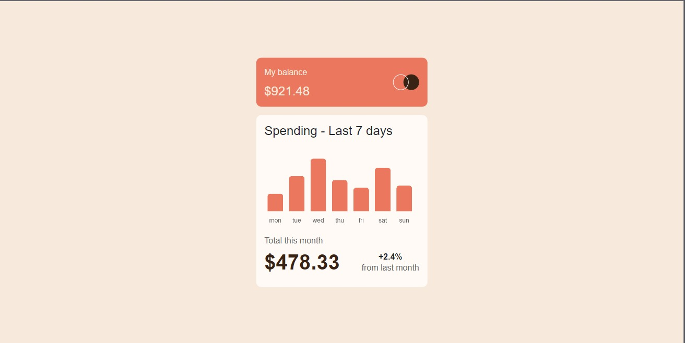

# Frontend Mentor - Expenses chart component solution

This is a solution to the [Expenses chart component challenge on Frontend Mentor](https://www.frontendmentor.io/challenges/expenses-chart-component-e7yJBUdjwt). Frontend Mentor challenges help you improve your coding skills by building realistic projects. 

## Overview

### Screenshot

### Links

- Solution URL: [Add solution URL here](https://github.com/seifelden66/Expenses-chart-componentfrontend-monetor-)
- Live Site URL: [Add live site URL here](https://your-live-site-url.com)

## My process

### Built with

- Semantic HTML5 markup
- CSS custom properties
- Flexbox
- CSS Grid
- Mobile-first workflow
- [vue](https://vuejs.org/) - JS library
- [nuxt.js](https://nuxtjs.org/) - vue framework
- [scss] For styles

## Author

- Website - [seif elden](https://seif-elden.netlify.app/?fbclid=PAAabBCVvtoSvpl8sd-mVAX6UYpEtESwxYm6FbJ_BhwO0e1m0XzNl_dZLi1rg)
- Frontend Mentor - [@seifelden66](https://www.frontendmentor.io/profile/seifelden66)

